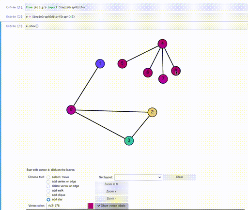

# Phitigra

[](https://mybinder.org/v2/git/https%3A%2F%2Fgitlab.limos.fr%2Fjfraymon%2Fphitigra/develop?filepath=demo.ipynb)

_Phitigra_ is a graph editor widget for [SageMath](www.sagemath.org)
when using the [Jupyter](www.jupyter.org) notebook.
<p></p>
(Note: this animation is from an older version of phitigra.)


Try the [demo](https://mybinder.org/v2/git/https%3A%2F%2Fgitlab.limos.fr%2Fjfraymon%2Fphitigra/develop?filepath=demo.ipynb) notebook on binder!

## Features

With phitigra one can:

  * draw graphs using the mouse to add vertices and edges
  * move the vertices positions, zoom in and out
  * draw undirected as well as directed graphs
  * choose the color of vertices and edges
  * apply various layout algorithms
  * easily retrieve the drawn graph for use with SageMath
  * run step-by-step a custom script on the drawn graph
  * change and refresh the drawing with external functions

## Non-features

The following are not supported:

  * multigraphs: multiple edges will not be drawn
  * large graphs: the rendering will be unpraticably slow
  
## Dependencies

  * [ipywidgets](https://github.com/jupyter-widgets/ipywidgets), for user interaction
  * [ipycanvas](https://github.com/martinRenou/ipycanvas), for the drawing

You might need the following
```
jupyter nbextension enable --py widgetsnbextension
```
after you install ipywidgets (see the [documentation](https://ipywidgets.readthedocs.io/en/latest/user_install.html)).

_Note:_ phitigra is not known to work with JupyterLab at the moment.

## How to try it?

### On binder

(Runs online, nothing to install.)  
Clicking [here](https://mybinder.org/v2/git/https%3A%2F%2Fgitlab.limos.fr%2Fjfraymon%2Fphitigra/develop?filepath=demo.ipynb) will open the demo notebook on binder in a new tab. Note that this uses the development version of phitigra, which may differ from the one in the `master` branch. 

### From a standalone SageMath installation

This assumes that SageMath is installed on your system. See http://www.sagemath.org for install instructions.

Clone the source from the repository
```
git clone https://gitlab.limos.fr/jfraymon/phitigra
```

To install or upgrade with pip:
```
sage -pip install --upgrade path/to/the/cloned/repository
```

That's it!

To uninstall:
```
sage -pip uninstall phitigra
```

Note that the above commands should not be run from the repository directory, otherwise `pip` [might](https://github.com/pypa/pip/issues/6703) complain that it did not find files to uninstall.

## Usage

```
from phitigra import GraphEditor
editor = GraphEditor(graphs.RandomGNP(10, 0.5))
editor.show()
# Now you can play with the graph!
```

A copy of the currently drawn graph can be obtained with the `get_graph` function:
```
G = editor.get_graph()
# Now G is a copy of the graph drawn in editor e
```

There are more examples in the [demo](demo.ipynb) notebook.

## Tests

As with SageMath's code, tests and code quality checks can be started with the `--tox` option (from the cloned directory):
```
sage --tox src/phitigra
```

## Changelog

### v0.2.3

  * Polished code, which now passes all tests 
  * Changed package structure to follows [python guidelines](https://packaging.python.org/tutorials/packaging-projects/)

### v0.2.2

  * Single (major) change: renaming ``SimpleGraphEditor`` into ``GraphEditor``. Code written for previous versions is not compatible with this one, but can be easily fixed.

### v0.2.1

  * Demo notebook
  * Binder link
  * Improved update time when moving vertices
  * Minor fixes

### v0.2.0

  * Docstrings and doctests in (almost) all functions
  * Hiding of internal objects
  * Cleaning code
