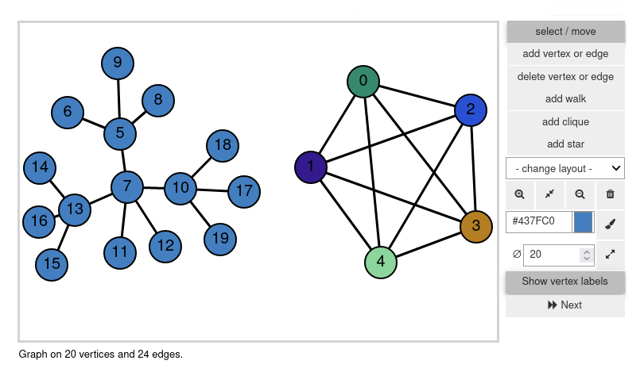

********
phitigra
********

This package provides a simple graph editor widget for SageMath/Jupyter.

The documentation of the package can be found at the following link:

.. toctree::
   :maxdepth: 1

   graph_editor

A screenshot of the current version of the widget:

A gif made with a previous version of the widget:

.. image:: images/phtgr.gif
   :width: 400px
   :alt:   Gif of the widget

See http://www.sagemath.org/doc/tutorial/ for information on how to use Sage.

Install instructions can be found in the README file of the `git repository <https://gitlab.limos.fr/jfraymon/phitigra>`_.

More examples can be found on the `demo file <https://gitlab.limos.fr/jfraymon/phitigra/-/raw/master/demo.ipynb?inline=false>`_, that you can also try online on `binder <https://mybinder.org/v2/git/https%3A%2F%2Fgitlab.limos.fr%2Fjfraymon%2Fphitigra/develop?filepath=demo.ipynb>`_.
